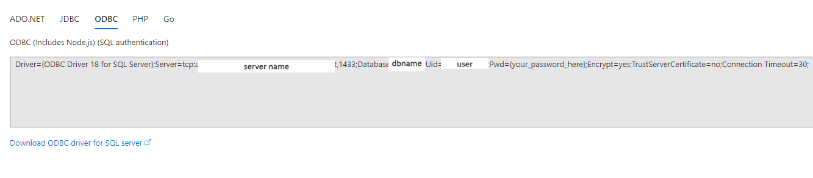
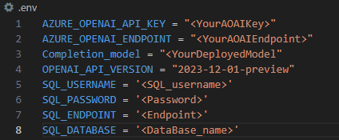

# AOAI-Langchain-SQL
In this repo, I am using GPT-4 turbo from Azure OpenAI, Azure SQL database and langchain to answer user's questions based on the information available on the SQL database. 

You can use the following links to create the requried resources: 
1) [Create Azure OpenAI Resource](https://learn.microsoft.com/en-us/azure/ai-services/openai/how-to/create-resource?pivots=web-portal)
2) [Create Azure SQL Database](https://learn.microsoft.com/en-us/azure/azure-sql/database/single-database-create-quickstart?view=azuresql&tabs=azure-portal) 

# Table of contents:
- [Step 1 - Installing the Requirements and Gettings Things Ready]
- [Step 2 - Loading the csv file data to Azure SQL database]
- [Step 3 - Configuring Chatbot]
- [Step 4 - Running the code] 


## Step 1 - Installing the Requirements and Gettings Things Ready

1. Initally, we would need to install the necessary python libraries for Azure OpenAI, dotenv, langchain, panadas, and sqlalchemy. 
Run the following command to install all required libraries: 
```
pip install -r requirements.text
```
2. You need to create .env file that will contain all the information related to your Azure OpenAI models.  
You can get the information related to the SQL database from the connection string tab for the SQL database on Azure portal as shown below:
.
From the above image you can find a link to download the necceary driver for the ODBC servce. This driver will allow you to connect to the Azure SQL database. 
Be sure to download the **ODBC Driver 18** 

4. Fill out your .env details as shown below:  


## Step 2 - Loading the csv file data to Azure SQL database:
This class will be used to create table, insert data, and load data from the SQL database. 
1. The create_engine() is the first function in the class that is used to create the connection to the Azure SQL database as shown below:
``` python
def create_engine(self):  
        username = os.getenv('SQL_USERNAME')  
        password = os.getenv('SQL_PASSWORD')  
        server = f"tcp:{os.getenv('SQL_ENDPOINT')}"
        database = os.getenv('SQL_DATABASE')  
        driver = "ODBC Driver 18 for SQL Server"  
        connection_string = f"mssql+pyodbc:///?odbc_connect=DRIVER={driver};SERVER={server};DATABASE={database};UID={username};PWD={password};Encrypt=yes;TrustServerCertificate=no;Connection Timeout=30;"  
        engine = create_engine(connection_string)  
        return engine
```

2. The create_table(), insert data() functions will be used to get the data from the loaded csv file and inserting the csv file contents in the database. User can define the name of the created table.
**Note: Make sure your CSV file contain columns with meaningful names that will help the AI model to understand which column to use.**
**My CSV file contains non-meaningful column names, the AI performed well to get data but it will perform much better with meaningful names.**

``` python
    def create_table(self, table_name):  
        # Use SQLAlchemy to generate the table schema from the dataframe  
        self.df.to_sql(table_name, self.engine, if_exists='replace', index=False)  
        print(f"Table {table_name} has been created in the database.")
      
    def insert_data(self, table_name):  
        # Use pandas to_sql method for inserting the data  
        self.df.to_sql(table_name, self.engine, if_exists='append', index=False)  
        print(f"Data has been inserted into {table_name} table.")
```
3. The read_db() function will be used to return an SQLDatabase from the engine connection so that it can be used as an sql database in the sql_agent:
``` python
def read_db(self):
        return SQLDatabase(self.engine)
```

## Step 3 Configuring Chatbot: 
You can modify the system message to instruct your GPT on how to answer user's question and what responses to provide. 
In my case, I asked the GPT to also provide the SQL command that it used to get information related to user's questions. 
``` python
prompt = ChatPromptTemplate.from_messages(
    [
        SystemMessage(
            content="""You are an AI assistance who can access an Azure SQL Database to get answers to customer's questions. 
            You mainly have <YourTableNames> table that you can check the table schema when you don't get information that will help you to answer the question.
            Always return the SQL command that you used to perform your query. 
            """
        ),  # The persistent system prompt
        MessagesPlaceholder(
            variable_name="chat_history"
        ),  # Where the memory will be stored.
        MessagesPlaceholder(
            variable_name='agent_scratchpad'
        ),  # where tools are loaded for intermediate steps.
        HumanMessagePromptTemplate.from_template(
            "{input}"
        ),  # Where the human input will injected
    ]
)
```

## Step 4 - Running the code: 

I have added this block of code to allow passing a CSV file when running the python script. 
``` python
if len(sys.argv[:]) > 1:
        df = pd.read_csv(sys.argv[1]).fillna(value=0)
        loader = SQLLoader(df)  
        table_name = input("What would you like to call the table?\n")
        loader.create_table(table_name)  
        loader.insert_data(table_name)
    else:
        loader = SQLLoader()
```
I created a while loop to keep the conversation on until the user tells the code to exit. 
``` python
while "exit" not in question.lower():  
        answer = agent_executor.invoke({"input": question})
        print(answer['output'])  
        question = input("\nDo you have other queries you would like to know about? if not type exit to end the chat.\n")
```
I have include the following video that shows how even when using different languages the GPT-4 was able to retrieve correct answers from the Azure SQL databse. 

 

Enjoy! 


Enjoy! 


